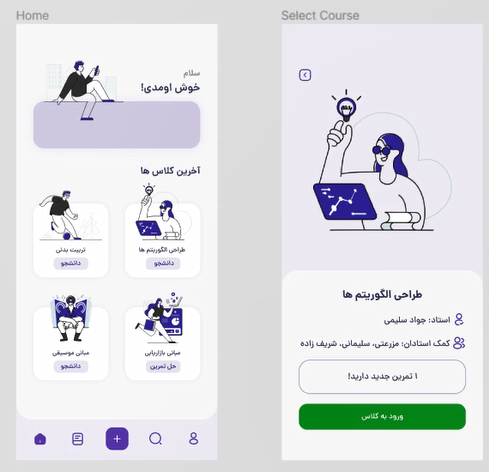

# Software engineering project

## سامانه حل تمرین

این سامانه ، به منظور تصحیح ساده تر تکالیف برای مدرسین حل تمرین و اساتید ، جهت نمره دهی دقیق تر و شناسایی تقلب و بررسی های گوناگون استفاده میشود.فایل های هربخش در Directory مربوط به آن قرار دارد.

 

**_فاز مهندسی نرم افزار و مهندسی خواسته های این پروژه به صورت تیمی توسط افراد زیر انجام شده است:_**

## معرفی اعضا :

- سرگروه : قوام الدین سلیمانی
- سید سپنتا حسینی پویا
- امید سلیمانی
- امیرحسین شریف زاده
- امید مزرعتی

 

## فاز های زیر برای پروژه انجام شده است

- تهیه سند خواسته های اولیه و لیست نیازمندی ها
- تهیه لیست کلاس های پروژه از طریق روش crc
- تهیه نمودار های طراحی شامل Class , Entity , State mach , Sequence
- طراحی تفصیلی و مقدماتی
- ایجاد دیتابیس پروژه

 
 

**موارد پرداخته شده:**
|       _مورد_       |      _بخش انجام شده_ |             _فاز هدف_             |          _پیش بینی_          |
| :----------------: | -------------------: | :-------------------------------: | :--------------------------: |
| تهیه سند خواسته ها |                  10% |                30%                |              -               |
|   رسم نمودار ها    |                  10% |                 -                 |              -               |
|       تهیه پروپوزال اولیه      | انجام شده |       -          |  اتمام تا پایان هفته آخر   |
|        طراحی تفصیلی و مقدماتی         |         به صورت انفرادی توسط سرگروه بعد از ترم ادامه یافت |                 -                 |     -     |

 

**ویرایش شده اسفند ماه 1400**

